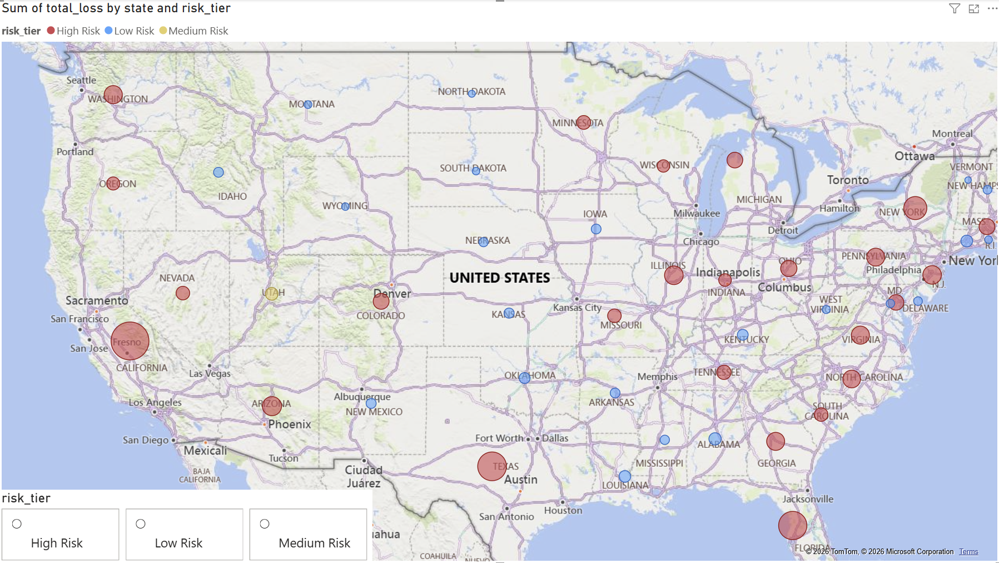

# FTC Consumer Sentinel 2024 — Fraud Analysis Project

## Project Overview
Analyzed the FTC Consumer Sentinel 2024 report (released March 2025) 
to identify fraud trends across the United States using Python, SQL, 
machine learning, and Power BI.

## Business Problem
The FTC reported consumers lost $12.5 billion to fraud in 2024 — a 25% 
increase over the prior year. This project identifies which fraud 
categories are growing fastest, which states are highest risk, and 
predicts high-loss states using machine learning.

## Key Findings
- Investment fraud caused the most financial damage at $5,697M total loss
- Social media is the highest-loss contact method at $1,858M
- California, Florida and Texas are the top 3 states by total fraud loss
- XGBoost model classified 25 out of 52 states as High Risk

## Tools Used
- Python (pdfplumber, pandas, XGBoost, SHAP, scikit-learn)
- SQL (SQLite)
- Power BI (3-page interactive dashboard)

## Project Structure
ftc-fraud-2024/
├── data/                        # Raw data from FTC.gov
├── notebooks/
│   └── 01_explore.ipynb         # Full analysis notebook
├── output/                      # Cleaned CSVs and charts
│   ├── fraud_categories.csv
│   ├── contact_methods.csv
│   ├── state_losses.csv
│   └── predictions.csv
└── README.md

## Dashboard Preview
## Dashboard Preview

## Data Source
FTC Consumer Sentinel Network Data Book 2024
https://www.ftc.gov/reports/consumer-sentinel-network-data-book-2024
